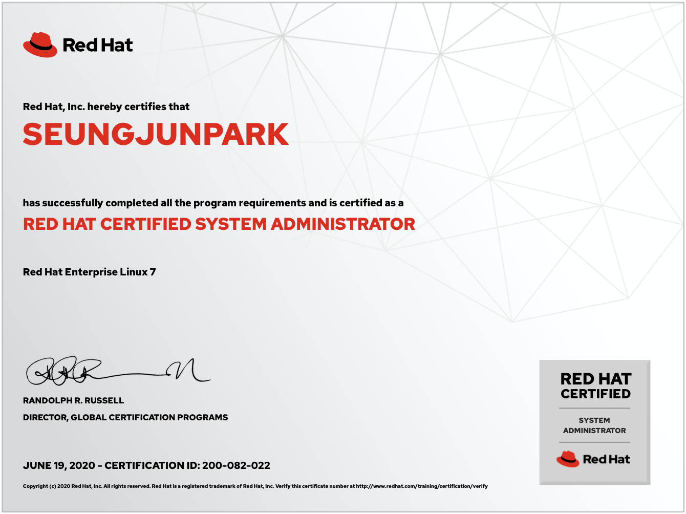
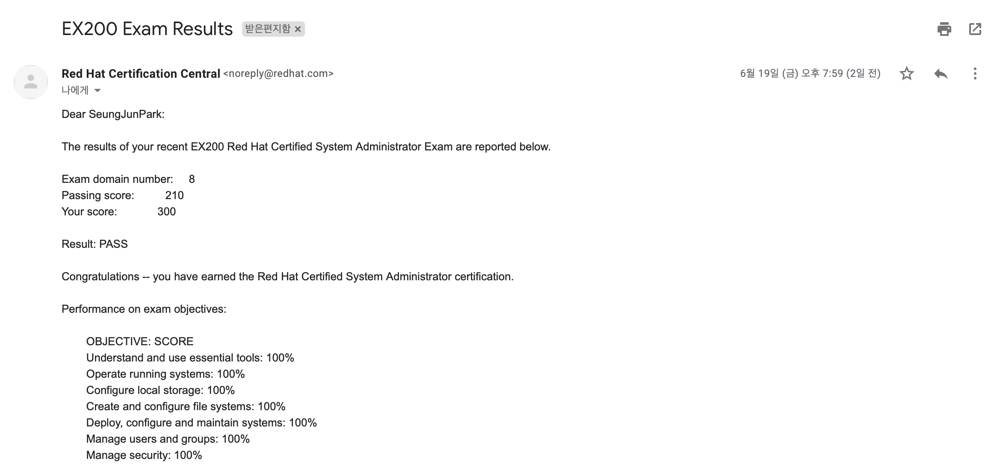

# RHCSA-study
Red Hat Certified System Administrator(RHCSA) Exam(EX200)

## 시험 신청
* 신청 주소: https://www.redhat.com/ko/services/training/ex200-red-hat-certified-system-administrator-rhcsa-exam
* 응시료: ₩ 420,000 (엄청나게 비싸다!) VAT 별도.

## 준비 환경
* Computer: Mac Book Pro
* OS: centos7 [다운로드 링크] (http://isoredirect.centos.org/centos/8/isos/x86_64/CentOS-8.1.1911-x86_64-dvd1.iso)
* Virtual Machine: VMWare Fusion [다운로드 링크](https://my.vmware.com/en/web/vmware/info/slug/desktop_end_user_computing/vmware_fusion/10_0)

## 결과 (2020.06.19)
- 성수 노브레이크에서 시험봤다.
- 300점 만점에 300점으로 합격했다. 
- 시험 당일 오후 8시쯤 결과가 나왔다.  
   
  
    
  
