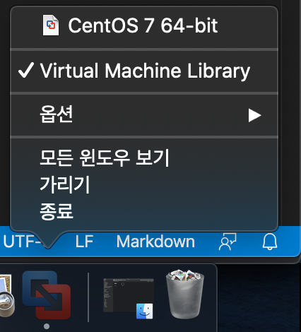
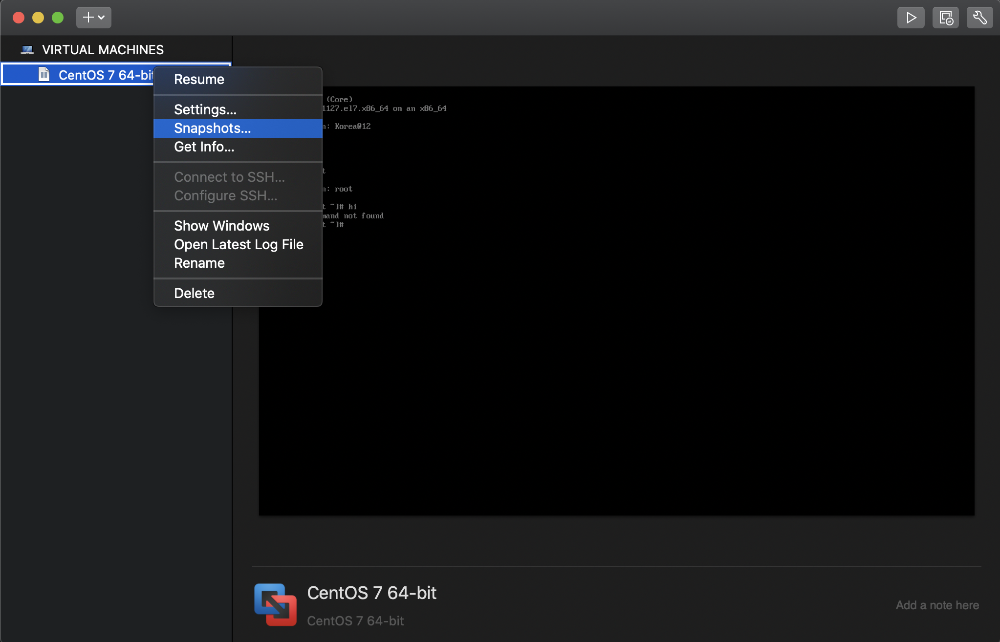
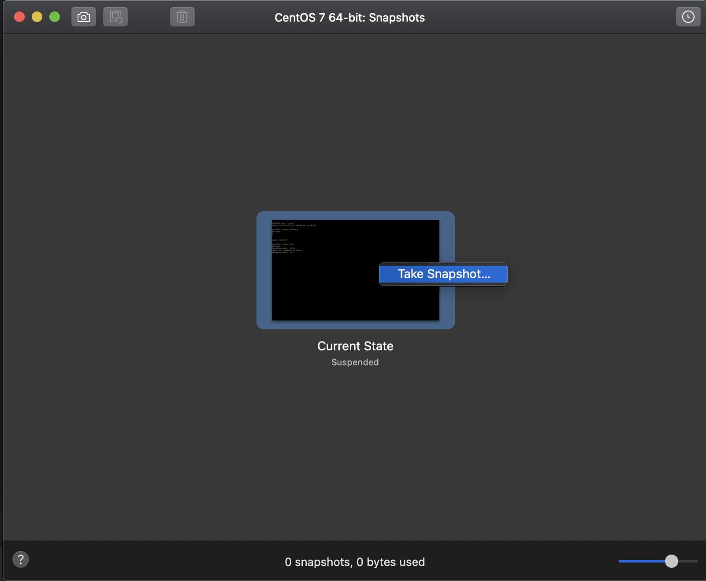
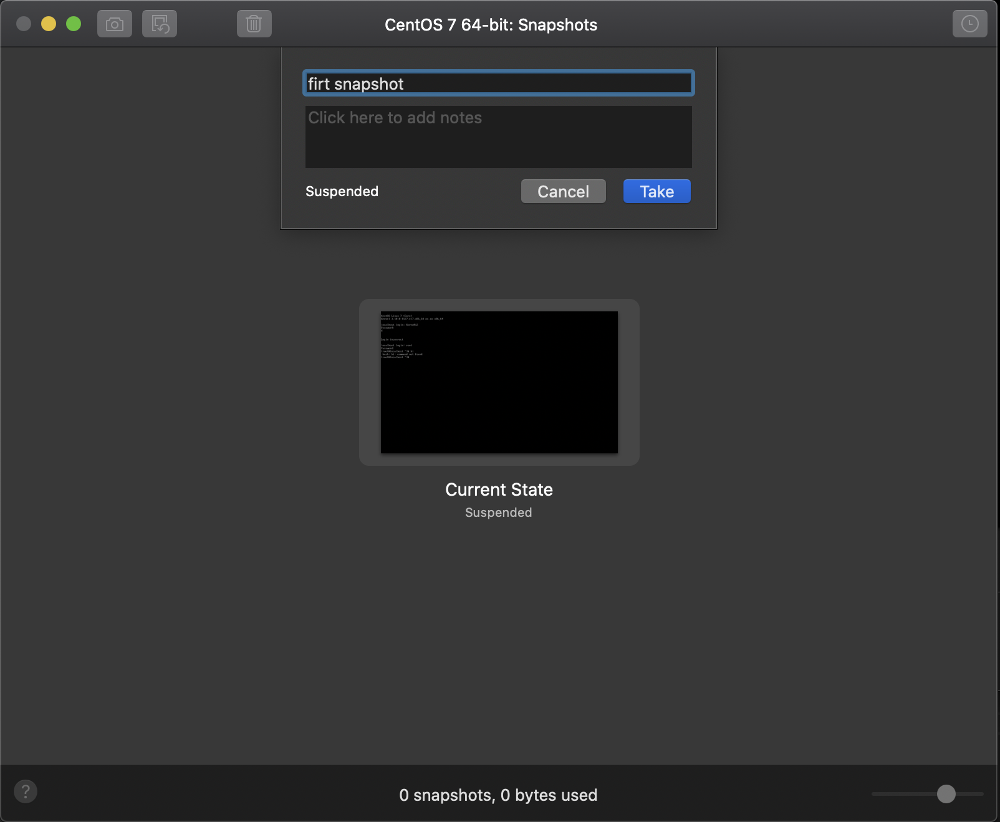
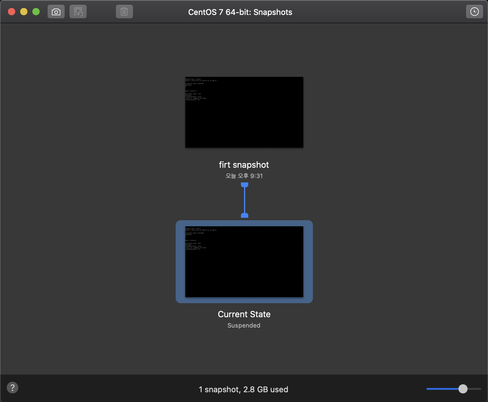

# RHCSA 준비를 위한 초기 환경 셋팅

### 사용환경
- Coumputer / Os: MacBook Pro 13" / Mac Os Catalina
- OS: centOS7.8 [다운로드링크](http://ftp.kaist.ac.kr/CentOS/7.8.2003/)
- Viture Machine: VMware Fusion [다운로드링크](https://www.vmware.com/kr/products/fusion/fusion-evaluation.html)


## A. VMware에  준비 및 centOS7 설치하기 
*****
## 1. 일단 깔아봅시다.
- VMware Fusion을 실행시킨 후 다운받은 centOS7 iso 파일을 드래그 앤 드롭한다.
- 시작!!! 
```
Could not open /dev/vmmon: 파이프 연결 해제됨.
```         
#### 다음과 같은 에러가 발생하였다. MAC 상의 VMware 권한 문제로 인해 발생되는 에러이다.
#### 아래와 같은 방법으로 해결하자.

### MAC -> 설정 -> 보안 및 개인정보 보호 에 들어가서

**허용** 버튼을 눌러주자.  
##   
*****
## 2. centOS 7을 설치해보자.
> ### 설치 방법에 관한 내용은 다루지 않겠다.
> [링크](https://blog.pheonixsolutions.com/install-centos-7-vmware-fusion-mac-os/)
> 참고하여 설치를 진행하자.

*****
## 3. 리눅스 꼬였을때를 위한 스냅샷
- 신나게 리눅스 명령어 치다보면 어디선가 잘못된진 모르겠지만 꼬일대로 꼬여 리눅스가 빌빌거리는 상황이 분명히 발생될것이다.  
- 스냅샷이라는 기능을 활용해 해당 상황을 현명하게 대처하자.

### 아래 사진과 같이 VMware 아이콘을 우클릭 한 뒤 Virture Machine Library에 들어가보자.


### Virture Machine Library 에서 사진과같이 snapshot을 선택한다.


### 그리고 아래와 같이 스냅샷을 생성하자




#### 스냅샷 생성 끝!
*****

### 이제 시작해보자.


